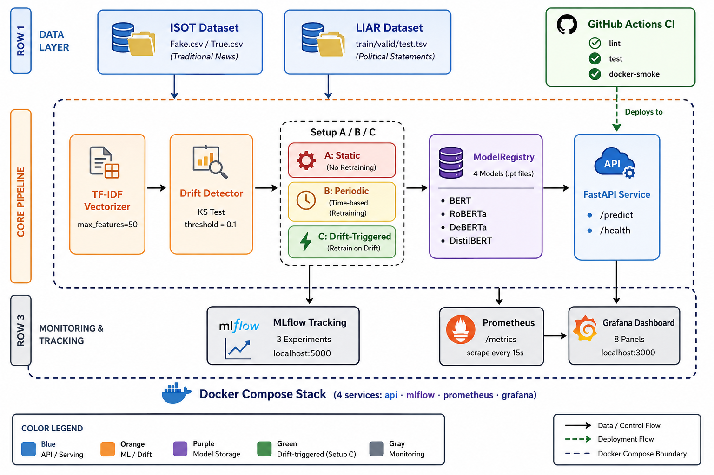

# Real-Time Fake News Detection MLOps Pipeline

[](https://github.com/umaimahashmi/fake-news-mlops/actions/workflows/ci.yml)
[](https://www.python.org/downloads/)
[](https://fastapi.tiangolo.com)
[](https://mlflow.org)
[](https://docs.docker.com/compose/)

> **Research Question:** Does drift-aware retraining improve fake-news detection accuracy when misinformation patterns evolve over time?

This repository accompanies the paper *"Drift-Aware MLOps for Fake News Detection: A Three-Setup Comparison Under Distributional Shift"*. It extends the transformer-based fake news detector from Rout et al. (2025) with a full production-grade MLOps pipeline including real-time inference, data drift monitoring, automated retraining, and experiment tracking.

---

## Key Results

| Setup | Strategy | Avg Accuracy | Retraining Cycles |
|-------|----------|:------------:|:-----------------:|
| A | Static (train once, never retrain) | 82.51% | 0 |
| B | Periodic (every 2 windows) | 88.48% | 4 |
| **C** | **Drift-triggered (KS test > 0.1)** | **86.81%** | **2** |

> Accuracy degrades from **98.5% → 57.8%** in Setup A by window 7 (severe drift).
> Setup C recovers to **92.5%** at the drift event (window 5, KS = 0.120) with **half the retraining cost** of Setup B.

**Transformer baseline (OptimalFNDModel, 7.28M params): ISOT 99.73% · LIAR 55.26%**

---

## Architecture



---
## Quick Start

### Prerequisites
- Docker Desktop (running)
- Python 3.11+
- ISOT dataset from [Kaggle](https://www.kaggle.com/datasets/clmentbisaillon/fake-and-real-news-dataset) → place `Fake.csv` and `True.csv` in `data/isot/`

### 1. Start the full stack

```bash
docker compose up -d
```

| Service | URL | Description |
|---------|-----|-------------|
| FastAPI | http://localhost:8000 | Inference API + Swagger docs |
| MLflow | http://localhost:5000 | Experiment tracking UI |
| Prometheus | http://localhost:9090 | Metrics scraping |
| Grafana | http://localhost:3000 | Live dashboard (admin/admin) |

### 2. Run a prediction

```bash
curl -X POST http://localhost:8000/predict \
  -H "Content-Type: application/json" \
  -d '{"text": "COVID vaccine causes autism according to leaked documents", "model": "bert"}'
```

**Response:**
```json
{
  "label": "fake",
  "confidence": 0.94,
  "model_used": "bert",
  "inference_time_ms": 142,
  "drift_score": 0.07
}
```


## Drift Detection

```
Reference corpus (window 0)
    ↓
TfidfVectorizer(max_features=50)
    ↓
For each new window:
    KS statistic per TF-IDF feature → mean KS score
    drift_detected = mean_ks > 0.1 (threshold)
```

**Drift simulation** — 8 windows of ISOT→LIAR mixing:

| Windows | ISOT % | LIAR % | Drift Level |
|---------|-------:|-------:|-------------|
| 1–3 | 100% | 0% | Stable baseline |
| 4–5 | 75% | 25% | Mild drift |
| 6–7 | 50% | 50% | Moderate drift |
| 8 | 25% | 75% | Severe drift |

---

## Prometheus Metrics

| Metric | Type | Description |
|--------|------|-------------|
| `fakenews_predictions_total` | Counter | Predictions by label + model |
| `fakenews_inference_latency_seconds` | Histogram | Latency by model |
| `fakenews_drift_score` | Gauge | Current KS drift score |
| `fakenews_retraining_total` | Counter | Retraining events by setup |
| `fakenews_model_accuracy` | Gauge | Accuracy by model + setup |
| `fakenews_active_models` | Gauge | Number of loaded models |
| `fakenews_request_errors_total` | Counter | Errors by model + type |

---

## CI/CD

**CI** runs on every push and pull request:
1. `black` + `isort` — auto-format check
2. `flake8` — lint (max line length 100)
3. `pytest` — full test suite
4. Docker Compose smoke test — `GET /health` must return 200

**CD** runs on merge to `main`:
- Builds and pushes Docker image to GitHub Container Registry (`ghcr.io`)

---

## Datasets

| Dataset | Samples | Classes | Source |
|---------|--------:|---------|--------|
| ISOT | ~44,000 | fake / real | [Kaggle](https://www.kaggle.com/datasets/clmentbisaillon/fake-and-real-news-dataset) |
| LIAR | ~12,800 | 6-class → binarized | [UCSB](https://www.cs.ucsb.edu/~william/data/liar_dataset.zip) |
---

## Author

**Umaima Hashmi**
Fake News Detection MLOps Pipeline — Track-II Research Paper, 2026
